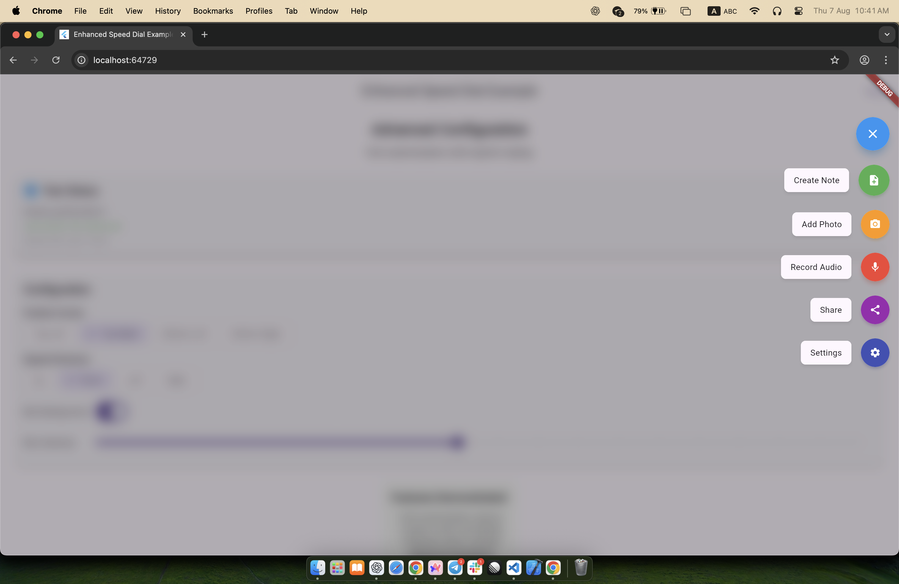
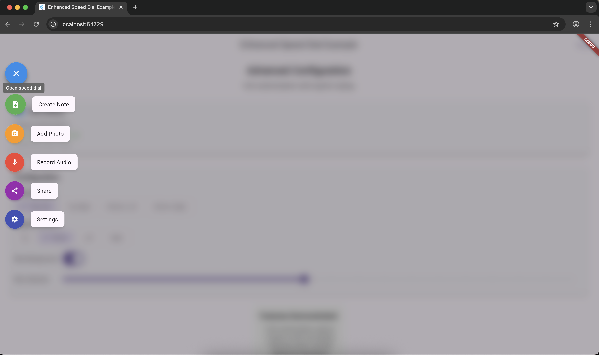
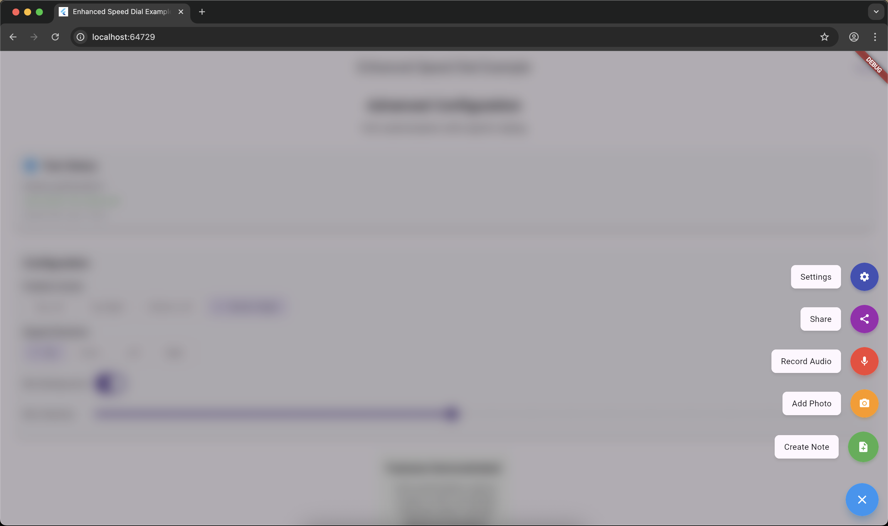

# Enhanced Speed Dial

A highly customizable Flutter package that provides an elegant speed dial floating action button with advanced blur background effects, flexible positioning, multiple direction layouts, and comprehensive styling options.

## 📸 Screenshots

| Screenshot 1 | Screenshot 2 | Screenshot 3 |
|--------------|--------------|--------------|
|  |  |  |

## ✨ Features

- 🎨 **Fully Customizable**: Complete control over colors, icons, animations, and styling
- 🌟 **Full-Screen Blur**: Backdrop blur effect that covers the entire screen using overlay
- ✨ **Smooth Animations**: Fluid icon rotation and option animations with custom curves
- 📍 **Flexible Positioning**: Position speed dial anywhere on screen
- 🧭 **Multiple Directions**: Options can expand up, down, left, or right
- 🎯 **Individual Option Styling**: Each option can have unique styling
- 📱 **Safe Area Support**: Proper positioning respecting device safe areas
- ♿ **Accessibility**: Built-in tooltip and semantic support
- 🔧 **Easy Integration**: Simple API with sensible defaults

## 🌟 Full-Screen Blur Background

When `showBlurBackground` is enabled, the Enhanced Speed Dial creates a full-screen overlay that:

- ✅ **Covers the entire screen** regardless of where the speed dial is positioned
- ✅ **Preserves option interactivity** by rendering them above the blur
- ✅ **Supports tap-to-close** functionality on the blurred background
- ✅ **Works seamlessly** as a `floatingActionButton` in Scaffold

## 📦 Installation

Add this to your package's `pubspec.yaml` file:

```yaml
dependencies:
  enhanced_speed_dial: ^1.0.0
```

Then run:

```bash
flutter pub get
```

## 🚀 Quick Start

### Simple Example (Recommended)

```dart
import 'package:flutter/material.dart';
import 'package:enhanced_speed_dial/enhanced_speed_dial.dart';

class MyHomePage extends StatelessWidget {
  @override
  Widget build(BuildContext context) {
    return Scaffold(
      appBar: AppBar(title: Text('Enhanced Speed Dial Example')),
      body: Center(child: Text('Hello World!')),
      floatingActionButton: EnhancedSpeedDial.simple(
        mainIcon: Icons.add,
        options: [
          SpeedDialOption.simple(
            label: 'Create Note',
            icon: Icons.note_add,
            onTap: () => print('Create Note tapped'),
          ),
          SpeedDialOption.simple(
            label: 'Add Photo',
            icon: Icons.photo_camera,
            onTap: () => print('Add Photo tapped'),
          ),
          SpeedDialOption.simple(
            label: 'Record Voice',
            icon: Icons.mic,
            onTap: () => print('Record Voice tapped'),
          ),
        ],
      ),
    );
  }
}
```

### Basic Example with Full Configuration

```dart
import 'package:flutter/material.dart';
import 'package:enhanced_speed_dial/enhanced_speed_dial.dart';

class MyHomePage extends StatelessWidget {
  @override
  Widget build(BuildContext context) {
    return Scaffold(
      appBar: AppBar(title: Text('Enhanced Speed Dial Example')),
      body: Center(child: Text('Hello World!')),
      floatingActionButton: EnhancedSpeedDial(
        mainIcon: Icons.add,
        options: [
          SpeedDialOption(
            label: 'Create Note',
            icon: Icons.note_add,
            color: Colors.green,
            heroTag: "create_note",
            onTap: () => print('Create Note tapped'),
          ),
          SpeedDialOption(
            label: 'Add Photo',
            icon: Icons.photo_camera,
            color: Colors.orange,
            heroTag: "add_photo",
            onTap: () => print('Add Photo tapped'),
          ),
        ],
      ),
    );
  }
}
```

## 🎛️ Advanced Customization

### Corner Positioning

```dart
EnhancedSpeedDial(
  mainIcon: Icons.menu,
  corner: SpeedDialCorner.topLeft, // topLeft, topRight, bottomLeft, bottomRight
  offsetFromEdge: 20.0, // Distance from screen edges
  direction: SpeedDialDirection.down, // up, down, left, right
  options: [...],
)
```

### Animation Customization

```dart
EnhancedSpeedDial(
  mainIcon: Icons.add,
  animationDuration: Duration(milliseconds: 400),
  animationCurve: Curves.elasticOut,
  rotateMainFab: true,
  rotationAngle: 3.14159, // π radians (180 degrees)
  options: [...],
)
```

### Blur Background Effects

```dart
EnhancedSpeedDial(
  mainIcon: Icons.add,
  showBlurBackground: true,
  blurIntensity: 20.0,
  blurOverlayColor: Color.fromRGBO(0, 0, 0, 0.5),
  closeOnBlurTap: true,
  options: [...],
)
```

### Comprehensive Styling

```dart
EnhancedSpeedDial(
  mainIcon: Icons.menu,
  openIcon: Icons.close,
  backgroundColor: Colors.blue,
  foregroundColor: Colors.white,
  elevation: 8.0,
  fabSize: 60.0,
  optionFabSize: 48.0,
  optionSpacing: 12.0,
  mainToOptionSpacing: 16.0,
  labelSpacing: 16.0,
  showLabels: true,
  labelStyle: TextStyle(
    fontWeight: FontWeight.bold,
    fontSize: 14,
  ),
  labelDecoration: BoxDecoration(
    color: Colors.white,
    borderRadius: BorderRadius.circular(8),
    boxShadow: [BoxShadow(blurRadius: 4, color: Colors.black26)],
  ),
  applySafeArea: false, // When using as Scaffold floatingActionButton
  options: [
    SpeedDialOption(
      label: 'Enhanced Action',
      icon: Icons.star,
      color: Colors.purple,
      foregroundColor: Colors.yellow,
      size: 52.0,
      elevation: 6.0,
      heroTag: "enhanced_action",
      tooltip: "Perform enhanced action",
      customLabel: Container(
        padding: EdgeInsets.symmetric(horizontal: 12, vertical: 6),
        decoration: BoxDecoration(
          color: Colors.purple.withOpacity(0.1),
          border: Border.all(color: Colors.purple),
          borderRadius: BorderRadius.circular(20),
        ),
        child: Text('Custom'),
      ),
      onTap: () => print('Enhanced action'),
    ),
  ],
)
```

## 📚 API Reference

### EnhancedSpeedDial Properties

| Property | Type | Default | Description |
|----------|------|---------|-------------|
| `options` | `List<SpeedDialOption>` | **required** | List of speed dial options |
| `mainIcon` | `IconData` | **required** | Main FAB icon when closed |
| `openIcon` | `IconData?` | `Icons.close` | Main FAB icon when open |
| `backgroundColor` | `Color?` | `null` | Main FAB background color |
| `foregroundColor` | `Color?` | `null` | Main FAB foreground color |
| `showBlurBackground` | `bool` | `true` | Enable full-screen blur overlay |
| `blurIntensity` | `double` | `10.0` | Blur intensity (sigma value) |
| `blurOverlayColor` | `Color` | `Color.fromRGBO(0, 0, 0, 0.3)` | Blur overlay color |
| `animationDuration` | `Duration` | `Duration(milliseconds: 250)` | Animation duration |
| `animationCurve` | `Curve` | `Curves.easeInOut` | Animation curve |
| `corner` | `SpeedDialCorner` | `SpeedDialCorner.bottomRight` | Screen corner position |
| `offsetFromEdge` | `double` | `16.0` | Distance from screen edges |
| `direction` | `SpeedDialDirection` | `SpeedDialDirection.up` | Expansion direction |
| `fabSize` | `double?` | `null` | Main FAB size |
| `optionFabSize` | `double?` | `null` | Option FAB size |
| `optionSpacing` | `double` | `8.0` | Spacing between options |
| `mainToOptionSpacing` | `double` | `8.0` | Spacing from main FAB to first option |
| `labelSpacing` | `double` | `16.0` | Spacing between label and button |
| `rotateMainFab` | `bool` | `true` | Enable main FAB rotation |
| `rotationAngle` | `double` | `2π` | Rotation angle in radians |
| `closeOnOptionTap` | `bool` | `true` | Close on option tap |
| `closeOnBlurTap` | `bool` | `true` | Close on blur background tap |
| `showLabels` | `bool` | `true` | Show option labels |
| `labelStyle` | `TextStyle?` | `null` | Global label text style |
| `labelDecoration` | `BoxDecoration?` | `null` | Global label card decoration |
| `labelPadding` | `EdgeInsetsGeometry?` | `null` | Global label padding |
| `applySafeArea` | `bool` | `true` | Apply SafeArea (disable for Scaffold FAB) |
| `heroTag` | `String?` | `null` | Main FAB hero tag |
| `tooltip` | `String?` | `null` | Main FAB tooltip |
| `initiallyOpen` | `bool` | `false` | Start in open state |
| `elevation` | `double?` | `null` | Main FAB elevation |
| `shape` | `ShapeBorder?` | `null` | Main FAB shape |
| `splashColor` | `Color?` | `null` | Main FAB splash color |
| `focusColor` | `Color?` | `null` | Main FAB focus color |
| `hoverColor` | `Color?` | `null` | Main FAB hover color |

### SpeedDialOption Properties

| Property | Type | Default | Description |
|----------|------|---------|-------------|
| `label` | `String` | **required** | Option label text |
| `icon` | `IconData` | **required** | Option icon |
| `onTap` | `VoidCallback` | **required** | Tap callback |
| `color` | `Color?` | `null` | Option background color (auto-generated if null) |
| `heroTag` | `String?` | `null` | Unique hero tag (auto-generated if null) |
| `tooltip` | `String?` | `null` | Tooltip text |
| `foregroundColor` | `Color?` | `Colors.white` | Foreground color |
| `size` | `double?` | `null` | Custom size |
| `elevation` | `double?` | `null` | Custom elevation |
| `shape` | `ShapeBorder?` | `null` | Custom shape |
| `enabled` | `bool` | `true` | Enable/disable option |
| `customLabel` | `Widget?` | `null` | Custom label widget |
| `showLabel` | `bool?` | `null` | Override global label visibility |
| `closeOnTap` | `bool?` | `null` | Override close behavior |
| `labelStyle` | `TextStyle?` | `null` | Custom label text style |
| `labelDecoration` | `BoxDecoration?` | `null` | Custom label decoration |
| `labelPadding` | `EdgeInsetsGeometry?` | `null` | Custom label padding |
| `labelSpacing` | `double?` | `null` | Custom label spacing |
| `margin` | `EdgeInsetsGeometry?` | `null` | Custom margin |
| `splashColor` | `Color?` | `null` | Custom splash color |
| `focusColor` | `Color?` | `null` | Custom focus color |
| `hoverColor` | `Color?` | `null` | Custom hover color |

### Enums

#### SpeedDialDirection

```dart
enum SpeedDialDirection {
  up,    // Options expand upward
  down,  // Options expand downward
  left,  // Options expand to the left
  right, // Options expand to the right
}
```

#### SpeedDialCorner

```dart
enum SpeedDialCorner {
  topLeft,     // Top-left corner of screen
  topRight,    // Top-right corner of screen
  bottomLeft,  // Bottom-left corner of screen
  bottomRight, // Bottom-right corner of screen
}
```

### Simple Constructors

For quick setup with minimal configuration, use the `.simple()` constructors:

#### EnhancedSpeedDial.simple()

```dart
EnhancedSpeedDial.simple(
  mainIcon: Icons.add,
  options: [...], // List of SpeedDialOption
)
```

#### SpeedDialOption.simple()

```dart
SpeedDialOption.simple(
  label: 'Action',
  icon: Icons.star,
  onTap: () => print('Tapped'),
)
```

Both constructors automatically handle color generation, hero tags, and other properties with sensible defaults.

## Example App

See the [example](example/) directory for a complete sample application demonstrating various features of the Enhanced Speed Dial package.

## Contributing

Contributions are welcome! Please feel free to submit a Pull Request.

## License

This project is licensed under the MIT License - see the [LICENSE](LICENSE) file for details.
